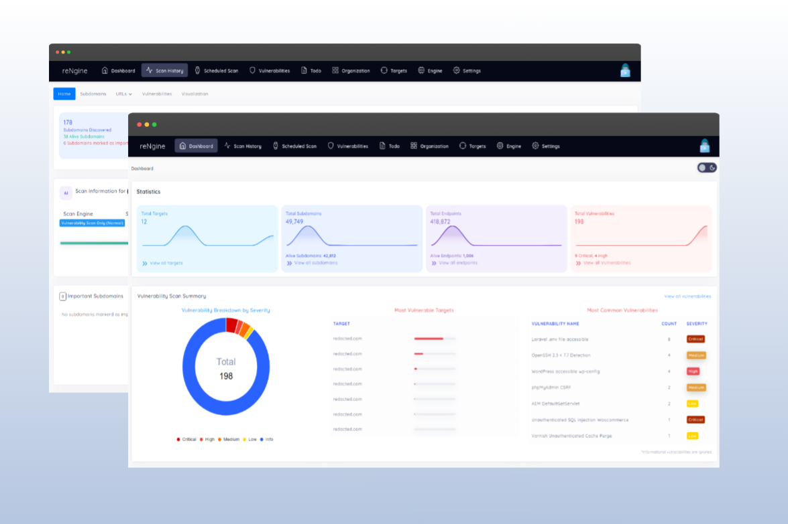
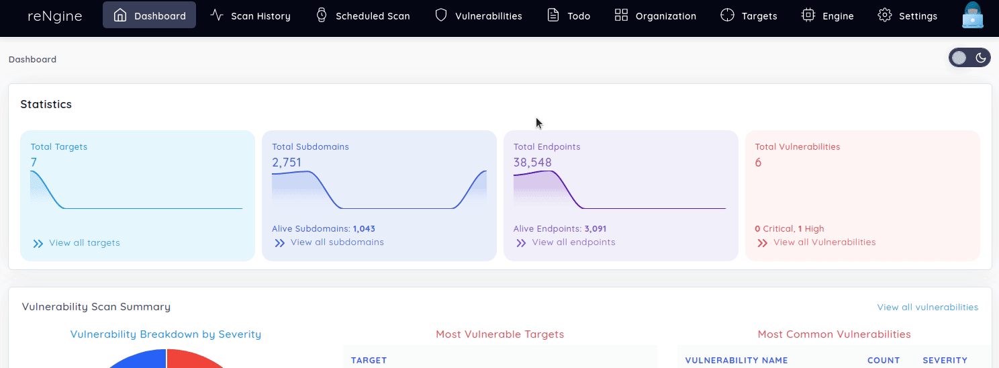
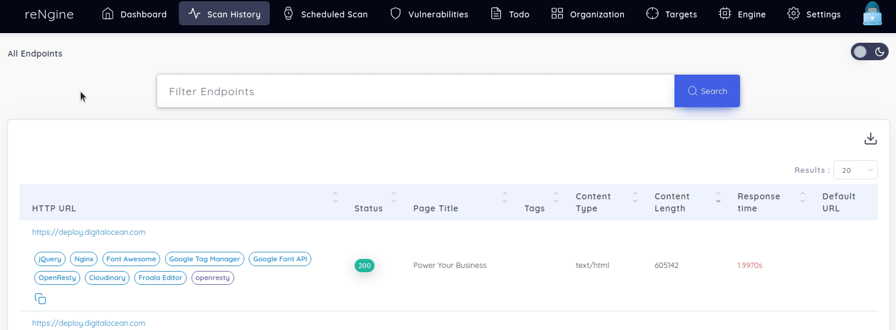
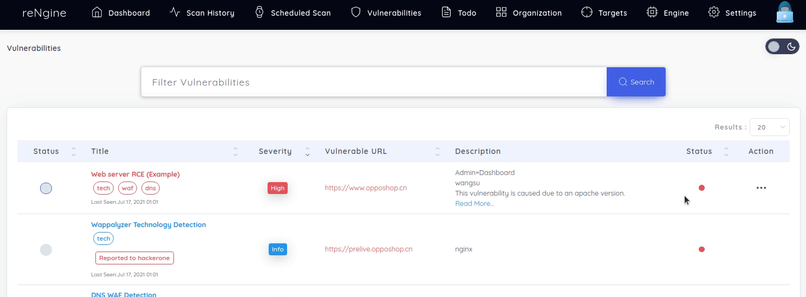
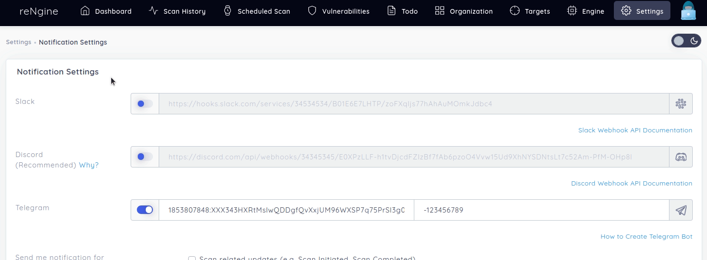
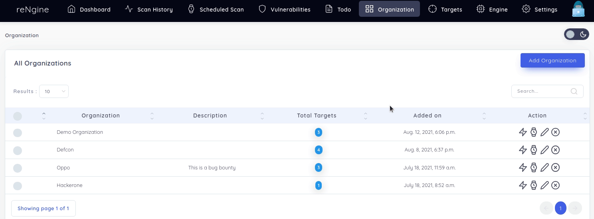
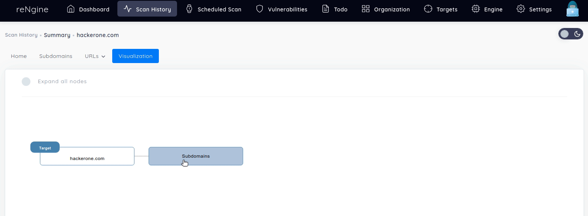
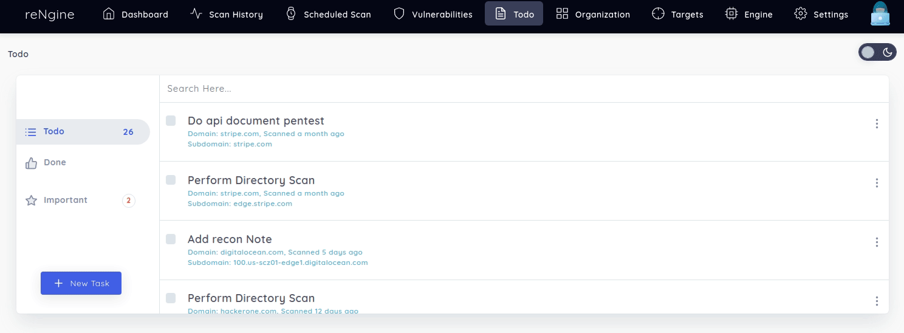

<p align="center">
<a href="https://rengine.wiki"></a>
</p>

<p align="center"><a href="https://github.com/yogeshojha/rengine/releases" target="_blank"></a>&nbsp;<a href="https://www.gnu.org/licenses/gpl-3.0" target="_blank"></a>&nbsp;<a href="https://github.com/yogeshojha/rengine/issues" target="_blank"></a>&nbsp;<a href="#" target="_blank"></a>&nbsp;<a href="https://huntr.dev/bounties/disclose/?target=https%3A%2F%2Fgithub.com%2Fyogeshojha%2Frengine" target="_blank"></a>&nbsp;</p>


<p align="center"><a href="https://www.youtube.com/watch?v=A1oNOIc0h5A" target="_blank"></a>&nbsp;<a href="https://www.youtube.com/watch?v=7uvP6MaQOX0" target="_blank"></a>&nbsp;<a href="https://drive.google.com/file/d/1Bh8lbf-Dztt5ViHJVACyrXMiglyICPQ2/view?usp=sharing" target="_blank"></a>&nbsp;</p>

<p align="center">
<a href="https://github.com/yogeshojha/rengine/actions/workflows/codeql-analysis.yml" target="_blank"></a>&nbsp;<a href="https://github.com/yogeshojha/rengine/actions/workflows/build.yml" target="_blank"></a>&nbsp;
</p>

<p align="center">
<a href="https://discord.gg/H6WzebwX3H" target="_blank"></a>&nbsp;
</p>

<p align="left">An automated reconnaissance framework for web applications with focus on highly configurable streamlined recon process via Engines, recon data correlation and organization, continuous monitoring, backed by database and simple yet intuitive User Interface.</p>

<p align="left">
reNgine makes is easy for penetration testers to gather reconnaissance with minimal configuration and with the help of reNgine's correlation, it just makes recon effortless.
</p>

Dashboard             |  Scan Results
:-------------------------:|:-------------------------:
  |  


<p align="center">
    ⭐<a href="https://rengine.wiki">reNgine Documentation</a>
    ·
    <a href="https://rengine.wiki/changelog/">What's new</a>
    ·
    <a href="https://github.com/yogeshojha/rengine/blob/master/CONTRIBUTING.md">Contribute</a>
    ·
    <a href="https://github.com/yogeshojha/rengine/issues">Report Bug</a>
    ·
    <a href="https://github.com/yogeshojha/rengine/issues">Request Feature</a>⭐
</p>


## Table of Contents

* [About reNgine](#about-reNgine)
* [Features](#features)
* [Documentation](#documentation)
* [Screenshots](#screenshots)
* [What's new in reNgine](#changelog)
* [Quick Installation](#quick-installation)
* [reNgine Bug Bounty Program](#reNgine-bug-bounty-program)
* [Contributing](#contributing)
* [reNgine Support](#reNgine-support)
* [Related Projects](#related-projects)
* [Support and Sponsor](#support-and-sponsoring)
* [Acknowledgements & Credits](#acknowledgements-and-credits)
* [License](#license)


## About reNgine




reNgine is an automated reconnaissance framework with a focus on a highly configurable streamlined recon process. reNgine is backed by a database, with data correlation and organization, the custom query “like” language for recon data filtering, reNgine aims to address the shortcomings of traditional recon workflow. Developers behind the reNgine understand that recon data can be huge, manually looking up for entries to attack could be cumbersome, with features like Auto Interesting Subdomains discovery, reNgine automatically identifies interesting subdomains to attack based on certain keywords (both built-in and custom) and helps penetration testers focus on attack rather than recon.

reNgine is also focused on continuous monitoring. Penetration testers can choose to schedule the scan at periodic intervals, get notified on notification channels like Discord, Slack, and Telegram for any new subdomains or vulnerabilities identified, or any recon data changes.

Interoperability is something every recon tool needs, and reNgine is no different. Beginning reNgine 1.0, we additionally developed features such as import and export subdomains, endpoints, GF pattern matched endpoints, etc. This will allow you to use your favourite recon workflow in conjunction with reNgine.

reNgine features Highly configurable scan engines based on YAML, that allows penetration testers to create as many recon engines as they want of their choice, configure as they wish, and use it against any targets for the scan. These engines allow penetration testers to use tools of their choice, the configuration of their choice. Out of the box, reNgine comes with several scan engines like Full Scan, Passive Scan, Screenshot gathering, OSINT Engine, etc.

Our focus has always been on finding the right recon data with very minimal effort. While having a discussion with fellow hackers/pentesters, screenshots gallery was a must, reNgine 1.0 also comes with a screenshot gallery, and what's exciting than having a screenshot gallery with filters, filter screenshots with HTTP status, technology, ports, and services.

We also want our fellow hackers to stay ahead of the game, reNgine 1.0 introduces automatic vulnerability reporting (currently only Hackerone is supported, other platforms *may* come soon). This allows hackers to define their own vulnerability report template and reNgine will do the rest of the job to report vulnerability as soon as it is identified.


## Features

- Perform Recon: Subdomain Discovery, Ports Discovery, Endpoints Discovery, Directory Bruteforce, Screenshot gathering
- IP Discovery, CNAME discovery, Vulnerability scan using Nuclei
- Ability to Automatically report Vulnerabilities to Hackerone
- Support for Parallel Scans
- Recon Data visualization
- Highly configurable scan engines
- OSINT Capabilities (Metainfo Gathering, Employees Gathering, Email Address with option to look password in leaked database, dorks etc)
- Customizable Alerts/Notification on Slack, Discord and Telegram
- Perform Advanced Query lookup using natural language alike and, or, not operations
- Support for Recon Notes and Todos
- Support for Clocked Scans (Run reconnaissance exactly at X Hours and Y minutes) and Periodic Scans (Runs reconnaissance every X minutes/hours/days/week)
- Proxy Support
- Screenshot Gallery with Filters
- Powerful recon data filtering with auto suggestions
- Recon Data changes, finds new/removed subdomains/endpoints
- Support for tagging targets into Organization
- Ability to identify Interesting Subdomains
- Support for custom GF patterns and custom Nuclei Templates
- Support for editing tool related configuration files (Nuclei, Subfinder, Naabu, amass)
- Ability to Mark Important Subdomains
- Interoperable with other tools, Import/Export Subdomains/Endpoints
- Option to send scan data directly to discord


## Documentation

You can find reNgine documentation at [https://rengine.wiki](https://rengine.wiki)

## Screenshots

**General Usage**


**Dark Mode**


**Recon Data filtering**


<details>
  <summary>Other Screenshots (Click to Expand!)</summary>

  **Auto Report Vulnerability to hackerone with customizable vulnerability report template**
  

  **Report Vulnerability Manually**
  

  **Customizable Notification**
  

  **Tagging Organization**
  

  **Recon data Visualization**
  

  **Upload custom GF and Nuclei patterns, with option to edit tool configuration**
  

  **Recon TODO**
  

</details>


## Changelog

You can watch [reNgine 1.0 release trailer here.](https://www.youtube.com/watch?v=_jBf_9qEG3U) (Recommended)

[Please find the latest release notes and changelog here.](https://rengine.wiki/changelog/)

  

## Quick Installation

**(Only Ubuntu/VPS)**

1. Clone this repo

```
git clone https://github.com/yogeshojha/rengine && cd rengine
```

2. Edit the dotenv file, **please make sure to change the password for postgresql POSTGRES_PASSWORD !**

```
nano .env
```

3. Run the installation script, Please keep an eye for any prompt, you will also be asked for username and password for reNgine.

```
sudo ./install.sh
```

if `./install.sh` does not have install permission, please change it, `chmod +x install.sh`

**reNgine can now be accessed from https://127.0.0.1 or if you're on the VPS https://your_vps_ip_address**

## Installation (Mac/Windows/Other)

Installation instructions can be found at [https://reNgine.wiki](https://reNgine.wiki)

## reNgine Bug Bounty Program

[](https://huntr.dev/bounties/disclose/?target=https%3A%2F%2Fgithub.com%2Fyogeshojha%2Frengine)

Security Researchers, welcome onboard! I am excited to announce bug bounty program for reNgine in collaboration with [huntr.dev](https://huntr.dev), this means you'll be rewarded for any security vulnerabilities discovered in reNgine.

Thank you for your interest in reporting vulnerabilities to reNgine! If you are aware of potential security vulnerabilities within reNgine, we encourage you to report immediately via [huntr.dev](https://huntr.dev/bounties/disclose/?target=https%3A%2F%2Fgithub.com%2Fyogeshojha%2Frengine)

**Please do not disclose any vulnerabilities via Github Issues/Blogs/Tweets after/before reporting on huntr.dev as it is explicitly against huntr.dev and reNgine disclosure policy and will not be eligible for monetary rewards.**

Please note that the maintainer of reNgine does not determine the bounty amount.
The bounty reward is determined by industry-first equation from huntr.dev to understand the popularity, impact and value of repositories to the open source community.

**What do I expect from security researchers?**

* Patience: Please note that currently I am the only maintainer in reNgine and will take sometime to validate your report. I request your patience throughout the process.
* Respect Privacy and Security Reports: Please do not disclose any vulnerabilities in public (this also includes github issues) before or after reporting on huntr.dev! That is against the disclosure policy and will not be eligible for monetary rewards.
* Respect the rules

**What do you get in return?**

* Much thanks from Maintainer
* Monetary Rewards
* CVE ID(s)

Please find the [FAQ](https://www.huntr.dev/faq) and [Responsible disclosure policy](https://www.huntr.dev/policy/) from huntr.dev.


## Contributing

Contributions are what make the open-source community such an amazing place to learn, inspire, and create. Any contributions you make are **greatly appreciated**. Your contributions could be as simple as fixing the indentations or fixing UI to as complex as bringing new modules and features.

See [contributing guide](.github/CONTRIBUTING.md) to get started.

You can also [join our discord channel #development](https://discord.gg/JuhHdHTtwd) for any development related queries.


### First-time Open Source contributors

Please note that reNgine is beginner-friendly. If you have never done any open-source yet, we encourage you to do so. **We will be happy and proud of your first PR ever.**

You can begin with resolving any [open issues](https://github.com/yogeshojha/rengine/issues).


## reNgine Support

Please do not raise any github issues for support requests. Instead, [join our discord channel #support](https://discord.gg/azv6fzhNCE)


## Related Projects

There are many other great reconnaissance frameworks, you may use reNgine in conjunction with these tools. But, they themselves are great, and may sometimes even produce better results than reNgine.

- [ReconFTW](https://github.com/six2dez/reconftw#sample-video)
- [Osmedeus](https://github.com/j3ssie/Osmedeus)
- [EchoPwn](https://github.com/hackerspider1/EchoPwn)


## Support and Sponsoring

If reNgine has helped you in any way, and you love this project and/or support active development of reNgine, please consider any of these options:

- Add a [GitHub Star](https://github.com/yogeshojha/rengine) to the project.
- Tweet about this project, or maybe blogs?
- Sponsor financially via Github or Paypal. https://paypal.me/yogeshojha11
- Join DigitalOcean using my [referral link](https://m.do.co/c/e353502d19fc) your profit is **$100** and I get $25 DO credit. This will help me test reNgine on VPS before I release any major features. ps. Please consider running reNgine/any recon on VPS!
- If you are looking for Proxies, please use [this referral](https://app.privateproxy.me/from/27103) link to purchase. Or you can also use coupon `rengine` here on [PrivateProxy](https://privateproxy.me/), using coupon `rengine`, you'll get additional 25% off.

Together, we can make reNgine **better** every day!


## Acknowledgements and Credits
reNgine would not have been possible without the following individuals/organizations. Thanks to these amazing devs/hackers!

- Project Discovery
  - nuclei, httpx, naabu, subfinder
- Tom Hudson
  - gf, assetfinder, waybackurls, unfurl
- OWASP
  - amass
- Ahmed Aboul-Ela
  - Sublist3r
- Mauro Soria
  - dirsearch
- Corben Leo
  - gau
- Luke Stephens
  - hakrawler
- Jaeles Project
  - gospider
- Jing Ling
  - OneForAll
- FortyNorthSecurity
  - EyeWitness
- Christian Martorella
  - theHarvester
- Davidtavarez
  - pwndb
- Deepseagirl
  - degoogle
- Josué Encinar
  - Metafinder, Emailfinder
- Bp0lr
  - gauplus
- Nicolas Crocfer
  - whatportis
- Helmut Wandl
  - Gridzy.js

<div>reNgine official Icon is made by <a href="https://www.freepik.com" title="Freepik">Freepik</a> from <a href="https://www.flaticon.com/" title="Flaticon">www.flaticon.com</a></div>


## License
Distributed under the GNU GPL v3 License. See [LICENSE](LICENSE) for more information.


